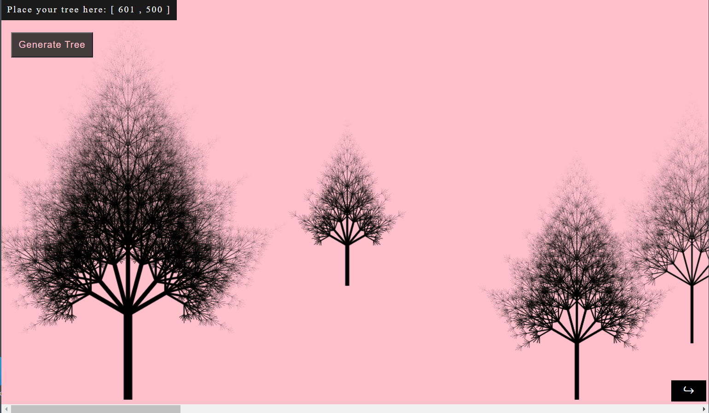

# JS Fractal Tree Generator

## Online preview:

[View picture fractal tree](https://fractal-tree-paint.netlify.app/)

> [](https://fractal-tree-paint.netlify.app/)

Find 2 different js file:
app_class.js
app_functional

Same thing in two different approach

## For basic functionality use this:

### Parameters

1. [x,y] screen coordinates --> for placing the tree on screen
   eg.: [700, 500]

2. tree length
   eg.: 70

3. tree rotate
   eg.: 0 -> for verticality

4. tree thick
   eg.: 9

### Usage

Open a console in web browser by using:
Ctrl + Shift + K for windows and Command + Option + K for Mac
and type:

```javascript
let tree1 = new Tree();
tree1.draw();

let tree2 = new Tree();
tree2.draw([700, 600], 100, 0, 5);

let tree3 = new Tree([1000, 700], 100, 0, 7);
tree3.draw();
```

## For much more versatility change the percentages here:


